# Entity Relationship Diagram

## Database Schema Overview

This ERD represents a mental health and wellness platform with user management, student tracking, counseling features, and community elements.

```mermaid
erDiagram
    %% Core User Management
    User {
        string id PK
        string email UK
        string salt
        string hash
        enum role
        enum status
        string firstName
        string lastName
        string phone
        datetime createdAt
        datetime updatedAt
        string avatar
        datetime lastLogin
    }

    %% User Role Extensions
    Student {
        string id PK
        string userId FK
    }

    Teacher {
        string id PK
        string userId FK
    }

    Counselor {
        string id PK
        string userId FK
    }

    Admin {
        string id PK
        string userId FK
    }

    %% Student-related Models
    EmergencyContact {
        string id PK
        string studentId FK
        string name
        string relationship
        string phone
        boolean isPrimary
    }

    Goal {
        string id PK
        string studentId FK
        string title
        boolean isCompleted
        int weekNumber
        int year
        string description
        datetime createdAt
        datetime updatedAt
    }

    WeeklyGoalSummary {
        string id PK
        string studentId FK
        int weekNumber
        int year
        int totalGoals
        int completed
        float percentage
        enum status
    }

    Journal {
        string id PK
        string studentId FK
        string content
        boolean isPrivate
        datetime createdAt
        datetime updatedAt
    }

    MoodEntry {
        string id PK
        string studentId FK
        int moodLevel
        string notes
        datetime createdAt
    }

    InitialAssessment {
        string id PK
        string studentId FK
        json assessmentData
        datetime createdAt
        float anxietyScore
        float depressionScore
        float stressScore
        float totalScore
        json answers
    }

    %% Survey System
    Survey {
        string id PK
        string title
        string description
        json questions
        datetime createdAt
        enum type
    }

    SurveyResponse {
        string id PK
        string studentId FK
        string surveyId FK
        json answers
        float score
        datetime createdAt
        float percentage
        string zone
        string phDate
    }

    %% Quiz System
    Quiz {
        string id PK
        datetime createdAt
        string studentId FK
        int correctAnswer
        string explanation
        string[] options
        int points
        string question
    }

    QuizAttempt {
        string id PK
        string quizId FK
        string studentId FK
        int score
        datetime createdAt
        int selectedAnswer
    }

    %% Counseling System
    Intervention {
        string id PK
        string counselorId FK
        string studentId FK
        string title
        string description
        enum status
        datetime createdAt
        datetime updatedAt
    }

    Report {
        string id PK
        string counselorId FK
        string studentId FK
        string reportType
        string format
        datetime startDate
        datetime endDate
        boolean includeCharts
        boolean includeTables
        boolean includeRecommendations
        datetime createdAt
    }

    %% Community Features
    ForumPost {
        string id PK
        string title
        string content
        string authorId FK
        datetime createdAt
        boolean isPublished
        json images
    }

    Comment {
        string id PK
        string content
        string postId FK
        string authorId FK
        datetime createdAt
    }

    Reaction {
        string id PK
        string postId FK
        string studentId FK
        string teacherId FK
        string type
        datetime createdAt
    }

    %% Messaging System
    Conversation {
        string id PK
        string title
        datetime createdAt
        datetime updatedAt
        boolean isGroup
    }

    Message {
        string id PK
        string content
        string senderId FK
        string conversationId FK
        boolean isRead
        datetime createdAt
    }

    %% Resources
    Resource {
        string id PK
        string title
        string description
        string url
        enum type
        datetime createdAt
    }

    %% Security
    PasswordHistory {
        string id PK
        string userId FK
        string hash
        string salt
        datetime createdAt
    }

    %% Relationships
    User ||--o{ Student : "has"
    User ||--o{ Teacher : "has"
    User ||--o{ Counselor : "has"
    User ||--o{ Admin : "has"
    User ||--o{ ForumPost : "creates"
    User ||--o{ Comment : "creates"
    User ||--o{ Message : "sends"
    User ||--o{ PasswordHistory : "has"

    Student ||--o{ EmergencyContact : "has"
    Student ||--o{ Goal : "has"
    Student ||--o{ WeeklyGoalSummary : "has"
    Student ||--o{ Journal : "has"
    Student ||--o{ MoodEntry : "has"
    Student ||--o{ InitialAssessment : "has"
    Student ||--o{ SurveyResponse : "submits"
    Student ||--o{ Quiz : "creates"
    Student ||--o{ QuizAttempt : "makes"
    Student ||--o{ Reaction : "gives"

    Teacher ||--o{ Reaction : "gives"

    Counselor ||--o{ Intervention : "creates"
    Counselor ||--o{ Report : "generates"

    Survey ||--o{ SurveyResponse : "receives"

    Quiz ||--o{ QuizAttempt : "receives"

    ForumPost ||--o{ Comment : "has"
    ForumPost ||--o{ Reaction : "receives"

    Conversation ||--o{ Message : "contains"
    Conversation ||--o{ User : "includes"

    Message ||--o{ User : "recipients"
```

## Key Features

### User Management
- **User**: Central user entity with authentication and profile data
- **Role-based extensions**: Student, Teacher, Counselor, Admin
- **Password security**: Password history tracking

### Student Wellness Tracking
- **Goals**: Weekly goal setting and tracking
- **Mood tracking**: Daily mood entries with notes
- **Journaling**: Private/public journal entries
- **Assessments**: Initial mental health assessments
- **Emergency contacts**: Student emergency contact information

### Survey & Quiz System
- **Surveys**: Configurable surveys with different types (daily, weekly, initial)
- **Responses**: Survey responses with scoring and analysis
- **Quizzes**: Educational quizzes with attempts tracking

### Counseling Features
- **Interventions**: Counselor-student intervention tracking
- **Reports**: Comprehensive reporting system with various formats

### Community Features
- **Forum posts**: Community discussion posts
- **Comments**: Post comments
- **Reactions**: Student/teacher reactions to posts

### Communication
- **Conversations**: Individual and group conversations
- **Messages**: Real-time messaging system

### Resources
- **Resources**: Educational resources (meditation, articles, videos, exercises)

## Database Indexes

The schema includes strategic indexes for:
- Student goals by week/year
- Survey responses by student and date
- Mood entries by student and creation date
- Quiz attempts by quiz and student
- Password history by user and creation date
- Emergency contacts by student
- Reports by counselor

## Enums

- **UserRole**: STUDENT, TEACHER, COUNSELOR, ADMIN
- **UserStatus**: ACTIVE, INACTIVE
- **GoalStatus**: COMPLETED, INCOMPLETE, EMPTY
- **SurveyType**: DAILY, WEEKLY, INITIAL
- **InterventionStatus**: PENDING, IN_PROGRESS, COMPLETED
- **ResourceType**: MEDITATION, ARTICLE, VIDEO, EXERCISE